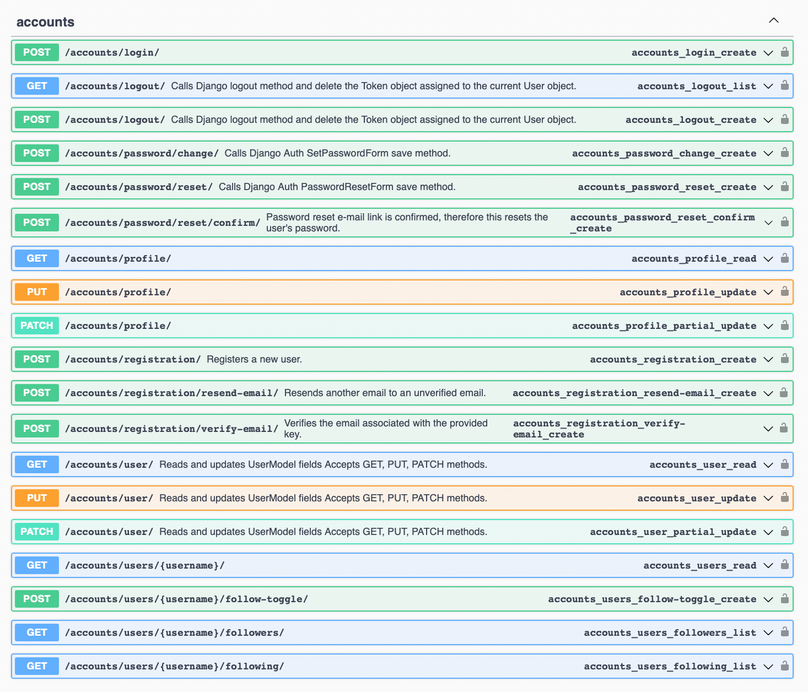

# final-pjt-금융 📊💡

**SSAFY 관통 프로젝트**
팀장: 이승민
팀원: 이세진

---

## 1. 프로젝트 개요

* **프로젝트명**: final-pjt-금융
* **목적**: 금융 상품(예금·적금) 비교·추천 플랫폼 서비스 구현을 통해, 사용자가 효율적으로 상품을 탐색·구독·관리할 수 있도록 지원
* **주요 요구사항**:

  1. 예금·적금 상품 목록 조회 및 금리·조건 비교 기능
  2. 관심 상품 구독/해제(즐겨찾기)
  3. 사용자 인증(회원가입·로그인) 및 프로필 관리(팔로우/언팔로우 포함)
  4. 커뮤니티 게시판(글/댓글/대댓글)
  5. OpenAI 기반 개인화 금융 챗봇 (추천 알고리즘 구현)

## 2. 시스템 아키텍처

```text
프론트엔드(Vue 3 + Pinia) ↔ 백엔드(Django REST framework) ↔ DB(SQLite 개발, PostgreSQL 운영)
                                     ↳ OpenAI GPT-4o-mini 연동(chat)
```

* **API 문서화**: drf-yasg Swagger UI
* **인증 방식**: JWT 토큰(djangorestframework-simplejwt) 및 DRF Token(Auth Token)
* **버전 관리**: GitLab (GitFlow)

## 3. 주요 기능 및 구현 세부사항

### 3.1 회원가입·로그인·프로필 관리 🔒

* **accounts 앱**에서 `dj-rest-auth`로 RESTful 인증 구현
* **RegistrationSerializer**: 이메일 검증, UUID 멤버십 번호 생성 로직
* **FollowToggleView**: `ManyToManyField(self)` 기반 팔로우 토글
* **Vue 컴포넌트**: `ProfileView.vue` (프로필 조회), `FollowButton.vue` (팔로우/언팔로우)

```js
// Pinia store: userStore.js
export const useUserStore = defineStore('user', {
  state: () => ({ profile: null }),
  actions: {
    async fetchProfile(username) {
      this.profile = await api.get(`/accounts/users/${username}/`);
    },
    async toggleFollow(username) {
      const res = await api.post(`/accounts/users/${username}/follow-toggle/`);
      this.profile = res.data;
    }
  }
});
```

### 3.2 금융 상품 조회·비교 & 구독 기능 💰

* **products 앱**: `DepositProductViewSet`, `SavingProductViewSet` 구현
* **@action**: 구독(POST `/subscribe/fin_prdt_cd/`), 해제(DELETE) 메서드
* **Vue 컴포넌트**: `ProductList.vue`, `ProductCard.vue`, `SubscribeToggle.vue`

```python
# ViewSet 예시
class DepositProductViewSet(viewsets.ModelViewSet):
    queryset = DepositProduct.objects.all()
    serializer_class = DepositProductSerializer

    @action(detail=True, methods=['post', 'delete'], url_path='subscribe')
    def subscribe(self, request, pk=None):
        product = self.get_object()
        user = request.user
        if request.method == 'POST': user.subscriptions.add(product)
        else: user.subscriptions.remove(product)
        return Response(status=status.HTTP_200_OK)
```

### 3.3 커뮤니티 게시판 & 댓글 구조 📝

* **community 앱**: `Post`, `Comment` 모델
* 댓글의 자기참조(`parent_id`)로 대댓글 트리 구조 지원
* **Vue 컴포넌트**: `PostList.vue`, `PostDetail.vue`, `CommentTree.vue` (재귀 렌더링)

```html
<template>
  <div class="comment" :style="{ marginLeft: depth * 1 + 'rem' }">
    <p>{{ comment.content }}</p>
    <CommentTree v-for="c in comment.children" :comment="c" :depth="depth+1" />
  </div>
</template>
```

### 3.4 OpenAI 기반 개인화 챗봇 🤖

* **chat 앱**: `/api/v1/chat/recommend/` POST: 사용자 질문 + 구독 상품 정보 기반 추천 답변 생성
* **OpenAI 연동**: API 호출 시, `messages` 배열에 system prompt + user prompt 조합
* **결과 캐싱**: Redis 사용 고려(현재는 Mock 서버로 테스트)

```python
response = openai.ChatCompletion.create(
    model="gpt-4o-mini",
    messages=[
        {"role": "system", "content": "금융 상품 추천 챗봇"},
        {"role": "user", "content": user_query}
    ],
)
```

## 4. ERD 다이어그램

아래 이미지는 프로젝트 주요 테이블 및 관계를 시각화한 ERD입니다:


## 5. API 명세서

### 5.1 Products 엔드포인트

\[Products API]\()

### 5.2 커뮤니티 & 챗봇 엔드포인트

\[Community & Chat API]\()

### 5.3 Accounts 인증 & 프로필 엔드포인트

\[Accounts API]\()

> **참고**: 위 스크린샷은 `http://127.0.0.1:8000/swagger/` 실행 결과입니다.

## 6. 테스트 및 검증

* **Unit Test (Pytest)**: Serializer/Model/Utils 로직 검증
* **Integration Test**: API Endpoints 순차 호출 및 응답 코드·데이터 검증
* **E2E Test (Cypress)**: 주요 CRUD 시나리오 자동화 테스트 스크립트 포함

## 7. 프로젝트 구조

```
final-pjt-금융/
├─ backend/
│  ├─ accounts/  (인증, 프로필)
│  ├─ products/  (금융 상품)
│  ├─ community/ (게시판)
│  ├─ chat/      (챗봇)
│  ├─ project/   (settings, urls)
│  └─ manage.py
└─ frontend/
   ├─ src/
   │  ├─ components/
   │  ├─ views/
   │  └─ stores/
   └─ package.json
```

---

**끝.**

